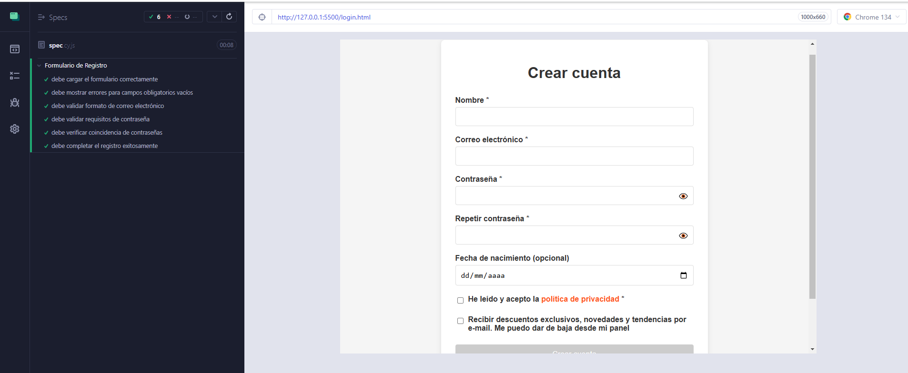

# Validacion__formulario_Cypress

Ejemplo de uso de cypress, para validar en este caso un formulario.

## Comprobaciones que se llevan a cabo.

### El formulario debe cargar correctamente
- Comprueba que los elementos del formulario existen y son visibles.

### Debe mostrar errores para campos obligatorios vacíos
- Comprueba que al intentar hacer click en el boton de enviar, los mensajes de error para cammpos vacios es visible.

### debe validar formato de correo electrónico
- Valida el formato de correo electronico, primero introduciendo en el campo de correo el valor 'correo-invalido', comprueba que aparece el mensaje de error de formato invalido.
- Despues introduciendo en el campo de correo el valor 'correo@valido.com', comprobando que no aparece el mensaje de error de formato invalido.

### debe validar requisitos de contraseña
- Valida el los requisitos de la contraseña (obligatorio, mínimo 8 caracteres, debe incluir al menos una letra mayúscula, una minúscula y un número), para ello introduce en el campo de contraseña los valores {'abc123',abc12345',abcdefghijk',ABC12345'} haciendo la comprobacion de que para cada uno aparece el mensaje de error contraseña no valida y especificando el tipo de error.
- Despues introduce en el campo de contraseña el valor 'Abc12345', comprobando que no aparece el mensaje de error de contraseña no valida.

### debe verificar coincidencia de contraseñas
- Valida que si introduces en el campo "confirmar-password" un valor diferente al introducido en el campo contraseña, salga un error.

### debe completar el registro exitosamente
- Valida que al compretar todos los campos correctamente y hacer click en enviar, la pagina de confirmacion deberá ser visible y con conteniendo la informacion de usuario correcta.
